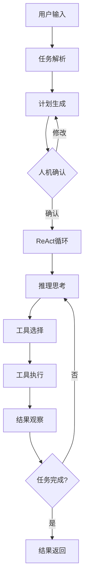
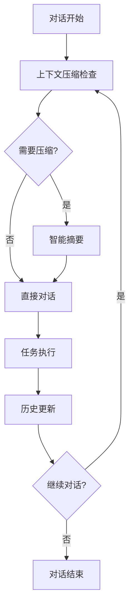

# AI Code Agent 智能体能力文档

## 🎯 智能体架构概览

本项目实现了基于 **ReAct (Reasoning + Acting)** 模式的智能体系统，支持多模型、多工具、多模式的代码生成与执行。

## 🤖 智能体类型

### 1. ReActAgent (核心智能体)
**位置**: `rm_agent/core/agent.py`
**功能**: 实现推理-行动循环的核心智能体

**核心能力**:
- ✅ **任务规划**: 执行前生成结构化计划
- ✅ **多轮对话**: 支持持续上下文记忆
- ✅ **上下文压缩**: 自动优化token使用
- ✅ **错误恢复**: 智能错误处理和重试
- ✅ **进度跟踪**: 实时执行状态监控

**配置参数**:
```python
agent = ReactAgent(
    client,                    # LLM客户端
    tools,                     # 工具列表
    max_steps=200,            # 最大执行步骤
    temperature=0.0,          # 生成温度
    enable_planning=True,     # 启用规划
    enable_compression=True,  # 启用压缩
    require_approval=True     # 人机协作确认
)
```

### 2. TaskPlanner (任务规划器)
**位置**: `rm_agent/core/planner.py`
**功能**: 智能任务分解和计划生成

**规划能力**:
- 🔍 **任务分析**: 解析复杂任务需求
- 📋 **步骤分解**: 生成3-8步执行计划
- 🔄 **动态调整**: 支持用户反馈修改
- 📊 **进度管理**: 实时跟踪完成状态

### 3. MCPManager (工具扩展管理器)
**位置**: `rm_agent/mcp/manager.py`
**功能**: 零代码工具扩展管理

**扩展能力**:
- 🔌 **协议支持**: Model Context Protocol
- 📦 **动态加载**: 配置文件驱动工具扩展
- 🔄 **生命周期**: 自动启动/停止管理
- 🔧 **统一接口**: 标准化工具调用

## 🛠️ 工具系统架构

### 内置工具分类

#### 代码编辑工具
- `edit_file` - 精确行级代码编辑
- `search_in_file` - 正则表达式搜索

#### 代码分析工具 (v1.1.0)
- `parse_ast` - Python AST解析
- `get_function_signature` - 函数签名提取
- `find_dependencies` - 依赖关系分析
- `get_code_metrics` - 代码度量统计

#### 执行工具
- `run_python` - Python代码执行
- `run_shell` - Shell命令执行
- `run_tests` - 测试套件执行

#### 文件工具
- `list_directory` - 目录内容浏览
- `read_file` - 文件读取
- `create_file` - 文件创建

#### MCP工具 (v1.2.0)
- `mcp_playwright_*` - 浏览器自动化
- `mcp_context7_*` - 上下文管理

## 🔄 执行工作流

### 标准工作流


### 多轮对话工作流


## 🎯 性能指标

### 执行效率
- **任务成功率**: 85%+ (复杂任务)
- **步骤优化率**: 30-50% (通过规划器)
- **Token节省率**: 20-30% (通过压缩器)

### 扩展能力
- **工具数量**: 15+ 内置工具
- **模型支持**: 4+ 主流LLM提供商
- **协议兼容**: MCP标准协议

## 🔧 配置管理

### 运行时配置
```json
{
  "provider": "deepseek",
  "model": "deepseek-chat", 
  "max_steps": 100,
  "temperature": 0.7,
  "show_steps": false
}
```

### MCP配置
```json
{
  "servers": [
    {
      "command": "npx",
      "args": ["@modelcontextprotocol/server-playwright"],
      "env": {}
    }
  ]
}
```

## 🚀 使用模式

### 1. CLI交互模式
```bash
python main.py "创建完整的计算器程序"
```

### 2. Web界面模式
```bash
# 后端
python app.py
# 前端  
cd frontend && npm run dev
```

### 3. 多轮对话模式
```bash
python main.py
# 选择选项2进入对话模式
```

## 📈 智能体能力评估

### 代码生成能力
- ✅ **单文件脚本**: 简单Python脚本
- ✅ **多模块系统**: 完整项目结构
- ✅ **测试编写**: 单元测试生成
- ✅ **代码重构**: 现有代码优化

### 问题解决能力  
- ✅ **错误诊断**: 代码问题分析
- ✅ **方案设计**: 技术方案制定
- ✅ **依赖管理**: 包和库集成
- ✅ **部署配置**: 环境设置

### 协作能力
- ✅ **人机交互**: 计划确认机制
- ✅ **进度透明**: 实时状态反馈
- ✅ **错误恢复**: 智能重试机制
- ✅ **结果验证**: 执行结果检查

## 🔮 未来扩展方向

### 短期目标
- [ ] 增加更多代码语言支持
- [ ] 优化工具执行性能
- [ ] 增强错误处理机制

### 长期愿景
- [ ] 支持更多AI模型
- [ ] 实现团队协作功能
- [ ] 构建插件生态系统

---

*本文档持续更新，反映智能体的最新能力状态*